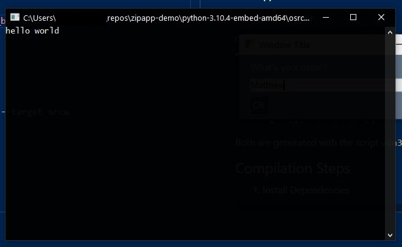
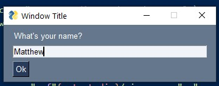

# Win32 Python Zipapp Demo

This project is an example of several of the uses of the zipapp bundling format added in Python 3.6+. The official examples are missing a few useful details required if you want to use this feature.

While the zipapp format is cross-platform, this example is focused on creating Windows executable wrappers and using them with the "embedded" distribution of Python.

Why would you want to do this? It allows you to bundle your Python app and dependencies as an exe, which is a launcher format that Windows users understand. The approach differs from projects such as PyExe and offers different pros and cons. The exe requires an existing installation of Python, or could be distributed with the Python Embedded distribution and/or a subset of that distribution. Finally, this method requires no external requirements beyond a C compiler.

Note that the `pyz` and `pyzw` extensions are executable on Windows and you can double-click them directly to launch an app, which is enough for many uses.

- [Official Documentation](https://docs.python.org/3/library/zipapp.html#making-a-windows-executable)
- [Python PCBuild README](https://github.com/python/cpython/blob/main/PCbuild/readme.txt)

## Prerequisites

- Windows (Tested on Windows 10)
- Python (Tested on 3.10.4 + development libs and debug symbols)
- Python Embedded Distribution (Same Version as installed above)
- MSVC C++ Build Tools (2017, 2019, 2022). Note: it may be necessary to use the [same version](https://pythondev.readthedocs.io/windows.html) with which your Python installation was compiled.

## Deprecation Warning

Starting in Python 3.10, `distutils` is deprecated and showing a warning. The build script in the example on the official documentation uses `distutils` as does this project. The documentation for `setuptools` (the recommended replacement) still needs updating, so for now I am just ignoring this warning.

## Project Output

This project will generate two example executables in the root directory:

- `osrc.exe` is a Windows console application that simply outputs a `print()` from Python.
- `osrcw.exe` is a Win32 Windows application that launches a window with PySimpleGUI from Python.

#### Console Wrapper


#### Windows Wrapper


Both are generated with the script `win32_build_wrapper.py`.

## Compilation Steps

1. Install Dependencies

```ps1
python -m pip install -r requirements.txt --target srcw
```

2. Run Build Steps

```ps1
python win32_build_wrapper.py
```
### Command Line Options

- `--no-zipapp`: Skip the zipapp step.
- `--no-compile`: Skip the compilation step.
- `--no-combine`: Skip the bundling step (exe+pyz).

## Optional: Compile Manually

You can build the wrapper exe manually on the command line with `cl.exe`, skipping the `distutils` dependency.

1. Open a Visual Studio (x64) Developer Command Prompt

Console build:

```
cl /I"C:\Program Files\Python310\include" .\wrapper.c /Fe:output\wrapperc.exe /Fo:output\wrapperc.obj  /link /LIBPATH:"C:\Program Files\Python310\libs" python3.lib
```

Or for `WINDOWS`:

```
cl /I"C:\Program Files\Python310\include" .\wrapper.c /DWINDOWS /Fe:output\wrapperw.exe /Fo:output\wrapperw.obj  /link /LIBPATH:"C:\Program Files\Python310\libs" python3.lib
```

### Distributing with Embedded Python

You can create a complete standalone distribution of Python for the app with your new executable wrapper as the launcher.

- [Windows Embeddable](https://docs.python.org/3/using/windows.html#windows-embeddable)
- [Downloads](https://www.python.org/downloads/windows/)

1. Download the zip file and unzip it. Use the same version of Python as that which you are compiling against.
2. Copy the `osrc.exe` and `osrcw.exe` files into the folder. 

The `osrc.exe` will run as is with this distribution, but some standard libraries aren't included with the embedded distribution, and Tkinter is one of them Since `osrcw.exe` requires Tkinter, we'll need to copy a few files from the base, installed Python. In our case, copy these to the root of the embed folder: `tcl` folder, `Lib/tkinter` folder to `tkinter`, `tk86t.dll`, `tcl86t.dll`, `_tkinter.pyd`.

Now `osrcw.exe` should run without issue, and without needing an existing Python installation. The embedded distribution could then be trimmed to only the dependencies needed to run the project. For example, these are the only dependencies required to run `osrcw.exe`.

```
d-----         4/15/2022  11:46 PM                tcl
d-----         4/15/2022  11:45 PM                tkinter
-a----         3/23/2022  11:22 PM          32792 libffi-7.dll
------         3/23/2022  11:22 PM          32763 LICENSE.txt
-a----         4/16/2022   8:51 AM         105115 osrc.exe
-a----         4/16/2022   8:51 AM        2469579 osrcw.exe
------         3/23/2022  11:22 PM         589053 python.cat
-a----         3/23/2022  11:22 PM          62416 python3.dll
-a----         3/23/2022  11:22 PM        4445648 python310.dll
------         3/23/2022  11:23 PM        2638493 python310.zip
------         3/23/2022  11:23 PM             80 python310._pth
-a----         3/23/2022  11:22 PM          26064 select.pyd
-a----         3/23/2022  11:22 PM        1866480 tcl86t.dll
-a----         3/23/2022  11:22 PM        1541872 tk86t.dll
-a----         3/23/2022  11:22 PM        1118672 unicodedata.pyd
-a----         3/23/2022  11:22 PM          98224 vcruntime140.dll
-a----         3/23/2022  11:22 PM          37256 vcruntime140_1.dll
-a----         3/23/2022  11:22 PM         119760 _ctypes.pyd
-a----         3/23/2022  11:22 PM         248272 _decimal.pyd
-a----         3/23/2022  11:22 PM         124368 _elementtree.pyd
-a----         3/23/2022  11:22 PM          60880 _hashlib.pyd
-a----         3/23/2022  11:22 PM          27600 _queue.pyd
-a----         3/23/2022  11:22 PM          75216 _socket.pyd
-a----         3/23/2022  11:22 PM          61904 _tkinter.pyd
```

There is a Windows Sandbox configuration file included with the project, allowing you to test this in isolation from your base system (requires Windows 10+ Pro). Edit the file to set the correct path for the mounted directory.